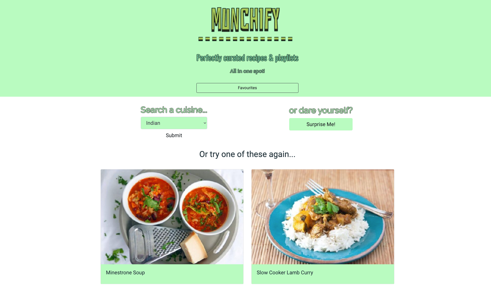
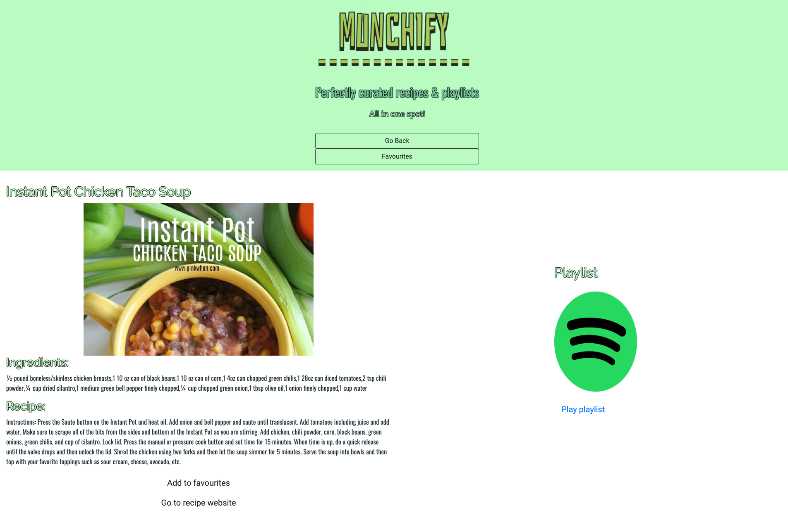

# Playlists for your recipes!

## Description
Application to generate a playlist from Spotify, alongside a recipe for a cuisine that has been chosen based on user input, or through random selection. The user can then store their favourite recipes and playlists to storage to be accessed when visiting next time.

We ran into some issues trying to implement the server, so we have currently set up the spotify functionality statically - with full searchable integration coming in an update soon.

Working on the project as a team has been a rewarding and educational experience. We have learnt a lot more about the git work flow and agile development.

## Features

- Dynamically generated HTML/CSS to load data based on user input
- AJAX calls to a server-side API Spoonacular
- Simple UI features to clearly layout functionality for the user to use
- Local storage to save user history and ability to store favourites
- model to warn user of navigating to a third-party website

## Coming soon

- server side calls to the Spotify API using node.js and express

## Link to deployed site

Please check out our example deployed site hosted on GitHub pages [munchify](https://stuart540.github.io/munchify/)

## Usage 

This page is currently functioning through the website link in browser. 

A near future update is intended to run from a deployed site, which can host our server application and make full use of the [Spotify](https://developer.spotify.com/) API

## Collaborators
Stuart Lansdowne (https://github.com/stuart540)
 
Sebastian Jones (https://github.com/sebastianj0nes)
 
Sam Callaway (https://github.com/Sam-Callaway)
 
Wai Man Tse (https://github.com/ra724619)
 
**Special thanks to Juno for teaching us, and troubleshooting, node.js
 

